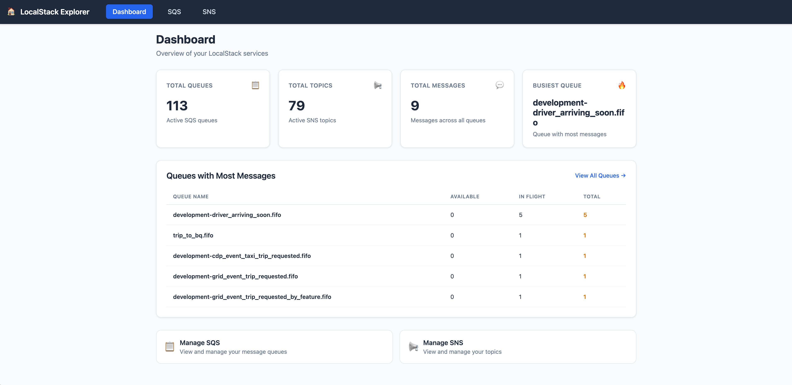
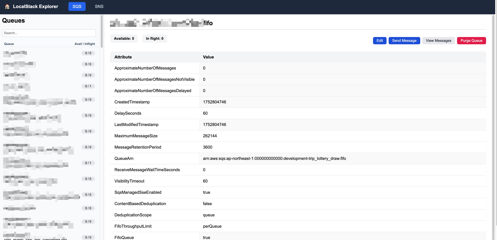

# LocalStack Web UI

A lightweight web interface to browse and edit Amazon SQS and SNS resources when using [LocalStack](https://github.com/localstack/localstack).

# Screenshots


*Modern dashboard with real-time metrics and navigation*

## Features

- **Modern Dashboard**
  - Real-time overview of SQS and SNS services
  - Live statistics: Total Queues, Total Topics, Total Messages, Busiest Queue
  - Top 5 queues with most messages (color-coded by message count)
  - Quick action cards for easy navigation
  - Auto-refresh every 30 seconds

- **Unified Navigation**
  - Consistent top navigation bar across all pages
  - Home icon for quick dashboard access
  - Seamless navigation between Dashboard, SQS, and SNS

- **SQS Dashboard**
  - List all queues with real-time message counts
  - View queue attributes in a friendly table (like AWS console)
  - Inline editing of writable attributes
  - Send a message to any queue (with support for FIFO MessageGroupId and DeduplicationId)
  - Peek at up to 5 current messages (non-destructive, with quick visibility reset)
  - Purge all messages in a queue (danger action)
  - Search bar, auto-refresh, and sidebar message counts
  - Loader overlay and success toast for smooth UX


*SQS dashboard: View, edit, send, peek, and purge messages in your queues*

- **SNS Dashboard**
  - List all topics
  - View topic attributes in a table
  - See all SQS queues subscribed to each topic
  - Search bar and resizable sidebar

## Getting Started

### Prerequisites

- Node.js 16+
- A running LocalStack container exposing SQS and SNS (default port **4566**)

### Installation

```bash
cd localstack-web
pnpm install
```

### Running

```bash
# on host machine
AWS_REGION=ap-northeast-1 pnpm start
```

Open `http://localhost:3001` (or the port you configured) in your browser.

### Docker Compose Service

Add this snippet to your `docker-compose.yml` if you prefer to run in the same network as LocalStack:

```yaml
  localstack-web:
    build: ./localstack-web
    environment:
      - LOCALSTACK_HOST=localstack      # match your LocalStack service name
      - AWS_REGION=ap-northeast-1
    ports:
      - "3001:3001"
    depends_on:
      - localstack
```

## Development

- The backend lives in `server.js` (Express + AWS SDK v2). Static assets are served from `public/`.
- Dashboard is in `public/index.html`
- SQS and SNS dashboards are in `public/sqs.html` and `public/sns.html`.

## Release

**v1.5.0** 🎉
- **Complete UI Redesign**: Modern dashboard with real-time metrics
- **Unified Navigation**: Consistent top navigation bar across all pages
- **Live Statistics**: Real-time overview of queues, topics, and message counts
- **Queue Monitoring**: Top 5 queues with most messages and color-coded status
- **Enhanced UX**: Improved loading states, error handling, and responsive design
- **Smart Text Handling**: Dynamic font sizing for long queue names
- **Quick Actions**: Easy access to SQS and SNS management

**v1.3.0**
- SQS: Add send message (with FIFO support), peek messages, and purge queue actions
- UI: Action buttons and stats now aligned for a cleaner look

**v1.2.0**
- Adds SNS dashboard: list topics, view attributes, see SQS subscriptions
- Home page to select SQS or SNS
- SQS dashboard unchanged from v1, but now lives at `/sqs.html`

---

Feel free to open issues or PRs for improvements! ✨ 